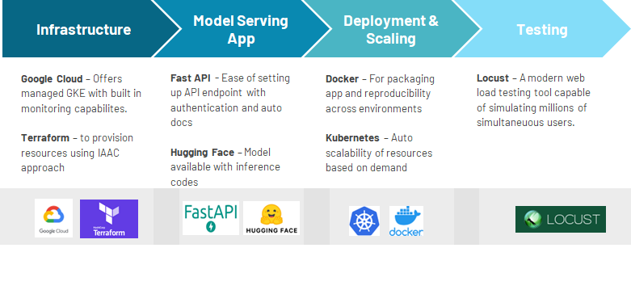
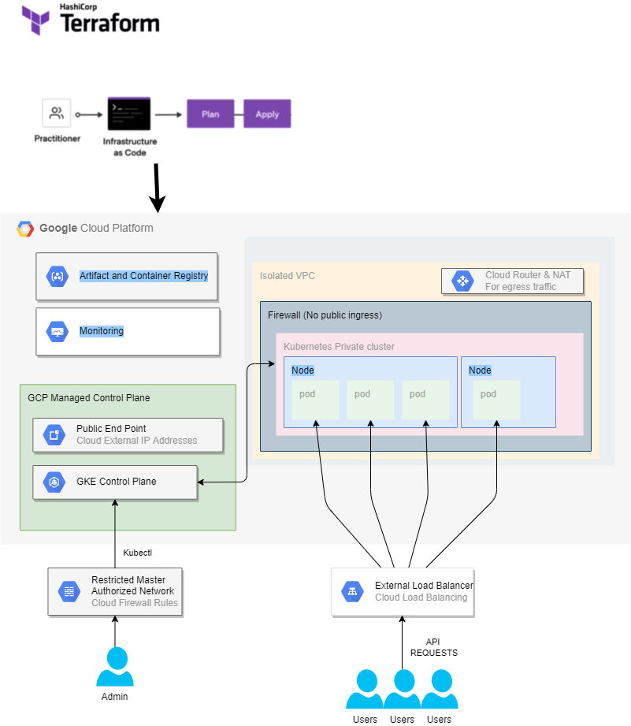

# TERRAFORM + GKE + FASTAPI + HUGGINGFACE

## Business Problem

>Imagine you are one of two founders of a start-up that specializes in document processing, you want to build a general document-form understanding API that your future customers can use to automate their paper forms. You don’t know how many customers you will have nor how many requests per day. But some market research has shown that your potential customers can process thousands of forms a day. Knowing the rough requirements, you decided to use cloud services for the flexibility to scale up and down.

Priorities:
1. Cost efficient 
   * Preemptible nodes
2. Highly scalable solution
   * Horizontal Autoscaling
3. Endpoints and resources secured from CyberSec perspective.
   * Private GKE cluster
   * Authorization Token to consume endpoint 

## Implementation Overview


## Solution Diagram


## Solution Deck
Read more for the detail implementation in [solution deck](resources/SolutionDeck.pdf)

## Steps

### 1. Authenticate to GCloud SDK

    Assuming Gcloud SDK has been installed. Else [link here](https://cloud.google.com/sdk/docs/install)
    ```bash
    $ gcloud auth application-default 
    ```
### 2. Terraform Plan and Apply

    To learn about using and installing terraform: [link here](https://learn.hashicorp.com/tutorials/terraform/install-cli)
    ```bash
    # Make sure you make adjustments to the variables.tf and main.tf for your environment. 
    cd terraform
    terraform plan -out tf.plan 
    terraform apply tf.plan          
    ```
    Might need to run a few times, because some services API needs to be enabled for the first time. 

### 3. Download model files from hugging face

   ```bash
   # CD to app directory and create folder for models
   cd app
   mkdir models    
   ```
    
   Thank you [philschmid](https://www.philschmid.de/fine-tuning-layoutlm) !
   ```python
   # You need to have transformer library installed
   # !pip install transformer

   from transformers import LayoutLMForTokenClassification, LayoutLMv2Processor
   model_path = "philschmid/layoutlm-funsd"
   save_to = "models/philschmid/layoutlm-funsd"
   processor = LayoutLMv2Processor.from_pretrained(model_path)
   model = LayoutLMForTokenClassification.from_pretrained(model_path)
   processor.save_pretrained(save_to)
   model.save_pretrained(save_to)
   ```

### 4. Build docker image and push to artifact registry

Install docker following this instruction: [link](https://docs.docker.com/engine/install/ubuntu/)
```bash
# Need to configure google cloud auth for docker registry
gcloud auth configure-docker asia-southeast1-docker.pkg.dev 

# Configure environment variable
export IMAGE_NAME="layoutlmv2"
export IMAGE_TAG="v1-1"
export LOCATION="asia-southeast1-docker.pkg.dev"
export REGISTRY="$LOCATION/<PROJECT NAME>/<REGISTRY NAME>"
export IMAGE_PATH="$REGISTRY/$IMAGE_NAME:$IMAGE_TAG"

# Build docker image and push to GCP artifact registry
# https://cloud.google.com/artifact-registry/docs/docker/pushing-and-pulling
docker build -t $IMAGE_NAME ./app/
docker tag $IMAGE_NAME:latest $IMAGE_PATH
docker push $IMAGE_PATH
```

### 5. Deploy Docker image to GKE as a service
Also setup horizonal pod autoscaler and expose the service thru external LB

kubectl needs to be installed: [link](https://kubernetes.io/docs/tasks/tools/)
Also setup kubectl access to GCloud GKE cluster: [link](https://cloud.google.com/kubernetes-engine/docs/how-to/cluster-access-for-kubectl)
```bash
# Setup credential to cluster via gcloud
gcloud container clusters get-credentials CLUSTER_NAME

# Register secret key to gke cluster
kubectl apply -f kubectl_configs/secrets.yaml # file excluded from git. This is where the secret key for decoding the token is defined. 

# Deploy app to gke cluster
envsubst < kubectl_configs/layoutlmv2_deployment.yaml | kubectl apply -f -
# Setup horizontal pod autoscaler
envsubst < kubectl_configs/layoutlmv2_hpa.yaml | kubectl apply -f -
# Create service with external load balancer
envsubst < kubectl_configs/layoutlmv2_extlb_svc.yaml | kubectl apply -f -

# Rollout restart to apply changes
kubectl rollout restart deployment $IMAGE_NAME
```

## CONGRATS! Your app is now deployed on GKE
Run command to test
```bash
wget http://wimcol.org/uploads/Exam_Notice.jpg && \
curl -m 10\
  -H "Authorization: Bearer <TOKEN>" \
  -F "file=@Exam_Notice.jpg" \
  http://<LoadBalancer END POINT>:80/inference_image/
  ```